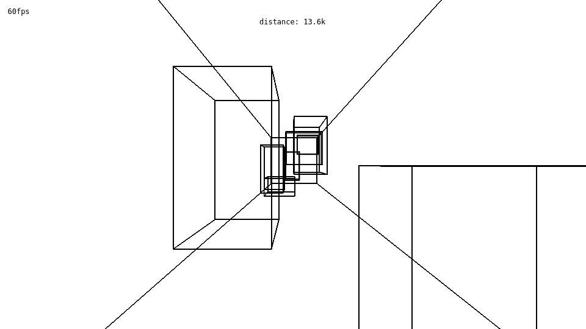

# WireBoids

## Description
3d game written entirely in canvas 2d context.

## Features

### 3d rendering
All drawing on screen is done by canvas 2d context. To obtain 3d wireframe graphics,
a series of transformations is done in `Context3d.mapPoint` method. This results in series of lines
drawn on screen that generate a sense of space.

### Smoothness
Game runs smoothly regardless of performance. Due to utilization of `deltaTime` in `GameEngine`,
all actions on screen are scaled to elapsed time from last loop execution. This means that playing
in 5fps doesn't give an edge to a player, compared to gameplay in 60fps. Frames are capped at 60fps,
but that can be configured in `GameEngine`.

### Structure
Structure of the game is split up into few sections. `GameEngine` handles game logic, time flow
and coordination, while classes in `3dContext.js` take care of rendering when asked. There is also
`GameWorld` class in `model.js` that stores information about objects in the game.

### Cube generation algorithm
To provide interesting gameplay, a custom algorithm for generating cuboids was created.
Obstacles are generated in groups of random size in given bounds. There is a minimum and maximum
distance between cuboids in a group. The same goes for distance between groups, but this distance
is bigger. If the cubes bounds were random, the player could exploit the algorithm and fly
on the border. To prevent this, cubes are sometimes generated out of bounds and clipped to
game space. 
